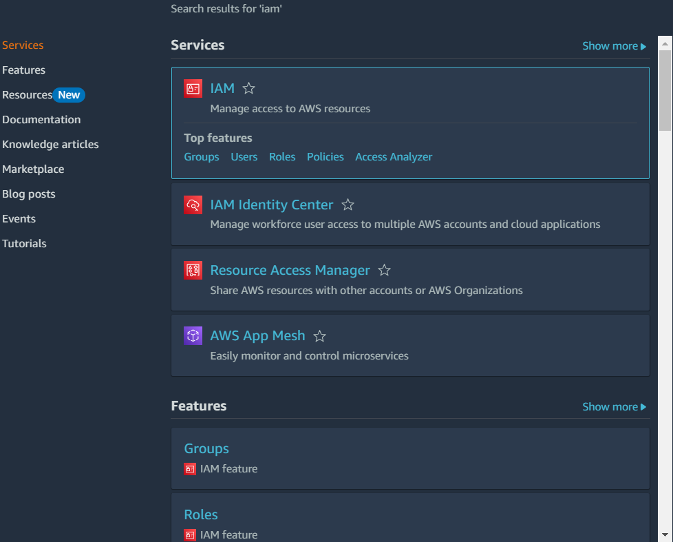
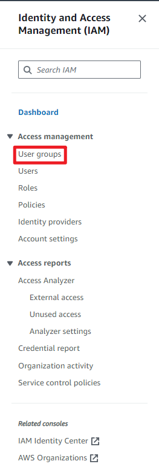
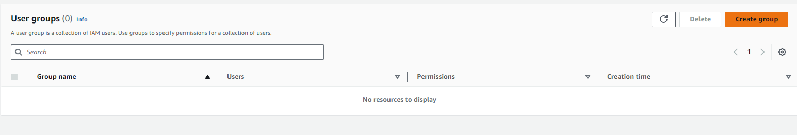
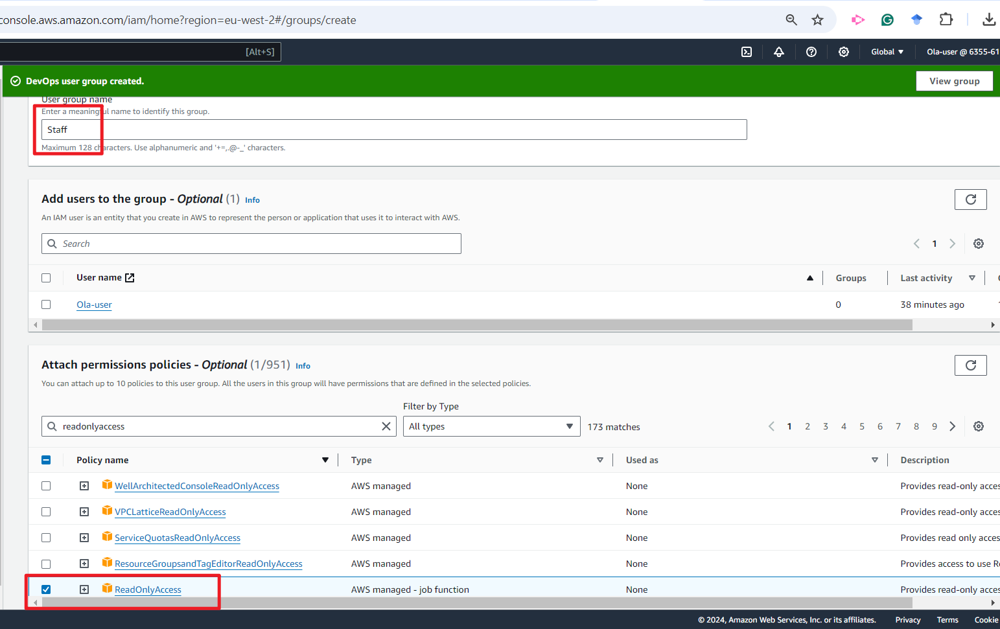
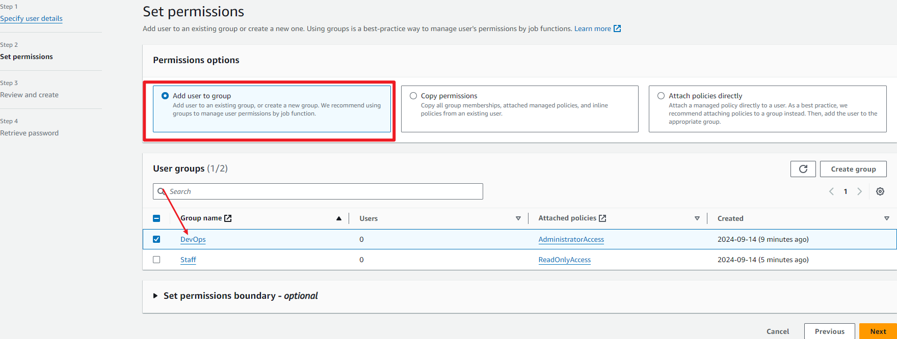
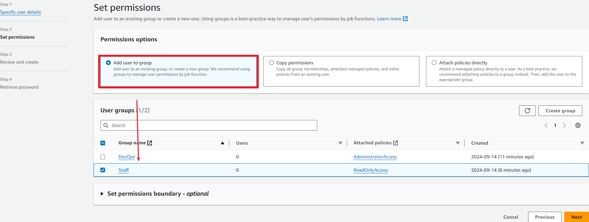
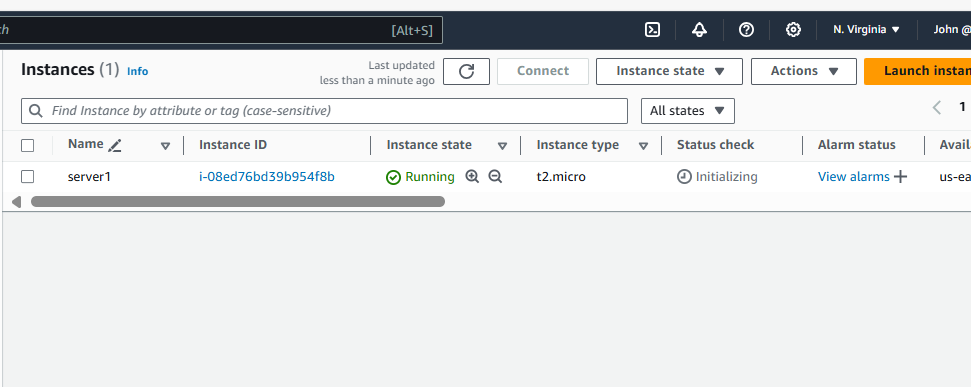
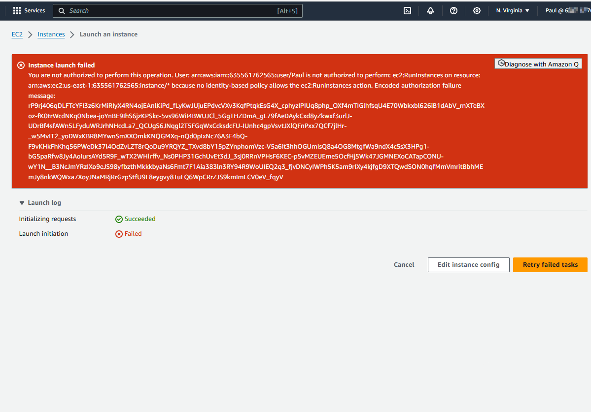

### Using AWS IAM service to create group, users, and assign policies 
This assignment involves creating 2 user groups where one of the groups has full access to all the AWS Resources while the othe group has view only access 
The challenge here is to create 2 users each belonging to each of the groups on which policies have been assigned. It is AWS best practice to assign policies to group users against attaching policies to users directly.The goal is to verify that the policies assigned to the groups are actually active on the users as soon as they are added to the groups.  The following steps were used to achieve the goal of this assignment 
1. Search for IAM service under the services menu

2. select user groups from the side bar menu

3. Give a name to the group and create the group

4. Attach the required policy(ies) the group as required or as needed, in the case of this assignment, adminisrator access policy was the required policy for the DevOps group while Readonly access was for the Staff group

5. Create the second group as well and attach the required policies just like before

6. Create a user John, and add this user to the DevOps group 

Create the second user Paul, add him to the Staff group.

7. Verify that John has access to the resources by creating an EC2 instance through his profile

8. Confirm if Paul also has the access by creating an EC2 instance with his profile as well.

9. John was able to spin up instances while Paul was denied access to launch however, he could view created instances.
10. Clean up used resources